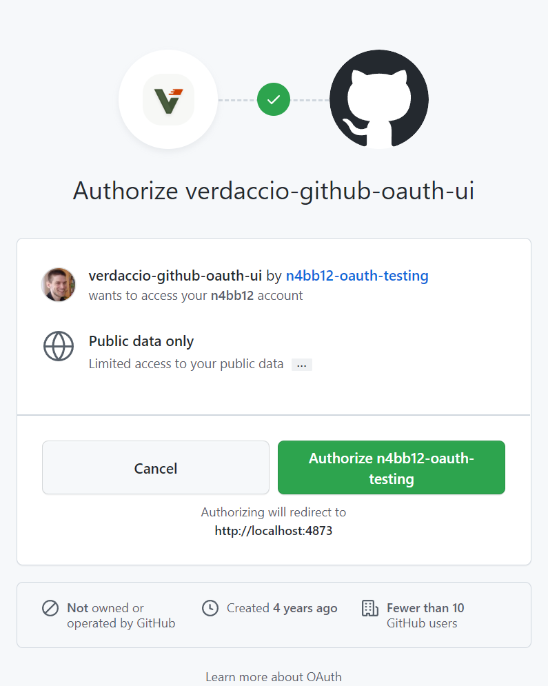
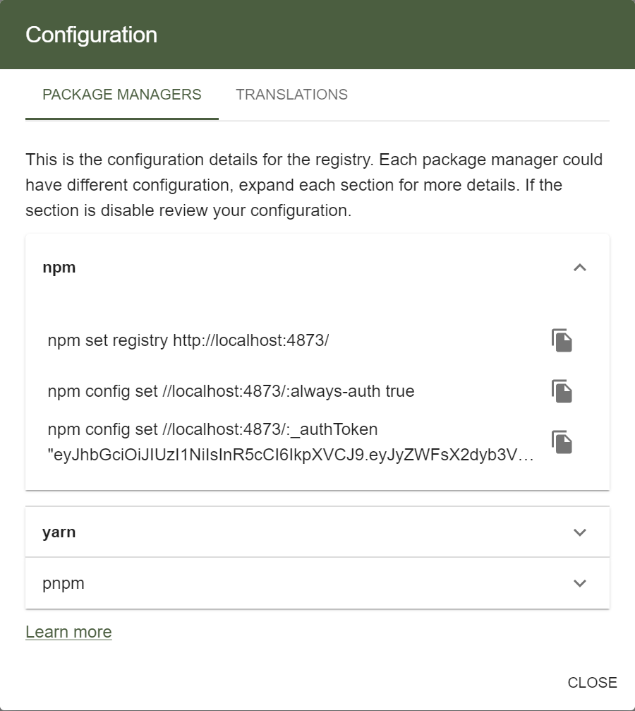
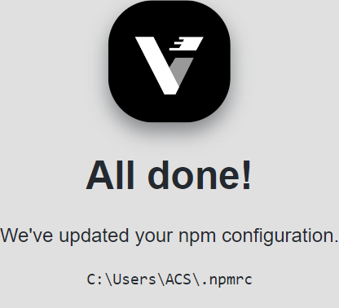

<h1 align="center">
  📦🔐 Verdaccio GitHub OAuth
</h1>

  A Verdaccio auth plugin for GitHub OAuth — With UI and command line integration — <a href="https://www.verdaccio.org">https://www.verdaccio.org</a>

  
  
  
  

## ℹ️ About

This Verdaccio plugin offers GitHub OAuth integration with the Verdaccio UI and the `npm` CLI.

## ✨ Features

| Feature                    | Description                                                                                                                                                                                                                                               |
| :------------------------- | :-------------------------------------------------------------------------------------------------------------------------------------------------------------------------------------------------------------------------------------------------------- |
| **Seamless Login**         | The login button [redirects you to GitHub](docs/usage.md#on-the-verdaccio-ui) instead of showing a login form.                                                                                                                                            |
| **UI Integration**         | [Usage info on the Verdaccio UI](docs/usage.md#option-b-using-the-commands-from-the-ui) is updated for use with GitHub OAuth.                                                                                                                             |
| **CLI Configuration**      | The plugin lets you [configure npm with a single command](docs/usage.md#on-the-command-line).                                                                                                                                                             |
| **Granular Authorization** | Access, publish, unpublish [package permissions can be limited](docs/configuration.md#configuring-package-access) to specific GitHub <kbd>users</kbd>, <kbd>organization members</kbd>, <kbd>team members</kbd>, and <kbd>repository collaborators</kbd>. |
| **Enterprise Support**     | Compatible with [GitHub Enterprise](docs/configuration.md#enterprise-origin-optional-string) instances.                                                                                                                                                   |
| **Proxy Support**          | Supports [proxy configuration](docs/configuration.md#-configuring-a-proxy) via standard proxy environment variables.                                                                                                                                      |

## � Documentation

| Topic                                          | Description                     |
| ---------------------------------------------- | ------------------------------- |
| [**Quick Start**](docs/quick-start.md)         | Get started quickly             |
| [**Installation**](docs/installation.md)       | Installation methods            |
| [**Configuration**](docs/configuration.md)     | Configuration options           |
| [**Usage**](docs/usage.md)                     | Usage instructions              |
| [**Compatibility**](docs/compatibility.md)     | Verdaccio version compatibility |
| [**Troubleshooting**](docs/troubleshooting.md) | Troubleshooting guide           |
| [**Contributing**](CONTRIBUTING.md)            | Contributing guidelines         |

## 📸 Screenshots

|                     Authorization                      |                           Configuration                           |                     Command Line                      |
| :----------------------------------------------------: | :---------------------------------------------------------------: | :---------------------------------------------------: |
|  |  |  |
