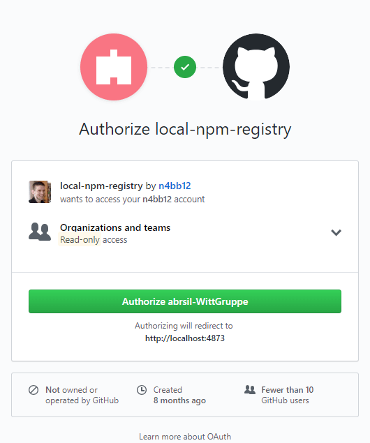
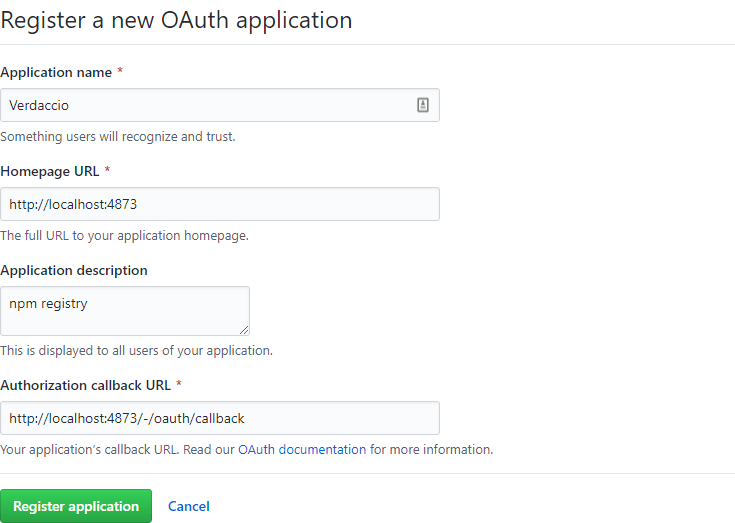
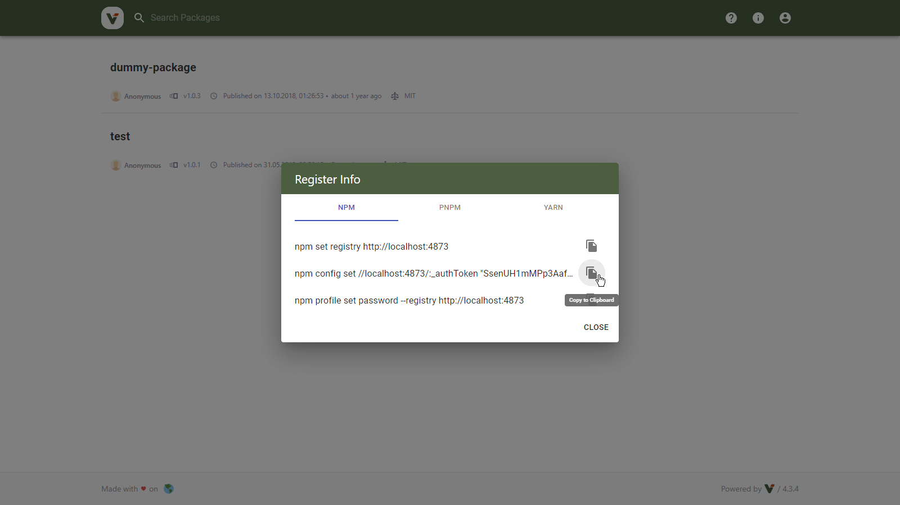

<h1 align="center">
  📦🔐 Verdaccio GitHub OAuth - With UI Support
</h1>

<p align="center">
  A GitHub OAuth Plugin for Verdaccio – <a href="https://www.verdaccio.org">https://www.verdaccio.org</a>
</p>

<p align="center">
  <a href="https://www.npmjs.com/package/verdaccio-github-oauth-ui">
    
  </a>
  <a href="https://raw.githubusercontent.com/n4bb12/verdaccio-github-oauth-ui/master/LICENSE">
    
  </a>
  <a href="https://github.com/n4bb12/verdaccio-github-oauth-ui/issues/new/choose">
    
  </a>
</p>

## About



This is a Verdaccio plugin that offers GitHub OAuth integration for both the browser and the command line.

### Features

- The Verdaccio login button redirects you to GitHub instead of showing a login form. Logout works, too.
- Login can be limited to members of a certain GitHub org.
- Package access/publish/unpublish can be limited to GitHub orgs, teams, repos, and users.
- The usage info is updated for use with GitHub OAuth.
- A built-in command-line tool helps you configure npm.

### Compatibility

- Verdaccio 5
- Node 14, 16
- Chrome, Firefox, Firefox ESR, Edge, Safari

If you would like to use this with Verdaccio 3-4, Node.js 10-13, or IE you can use version 2 of the plugin.

## Setup

### Install

```
$ npm install verdaccio-github-oauth-ui
```

### GitHub Config

- Create an OAuth app at https://github.com/settings/developers
- The callback URL should be `YOUR_REGISTRY_URL/-/oauth/callback`

Example:



### Verdaccio Config

Merge the below options with your existing Verdaccio config:

```yml
middlewares:
  github-oauth-ui:
    enabled: true

auth:
  github-oauth-ui:
    client-id: GITHUB_CLIENT_ID
    client-secret: GITHUB_CLIENT_SECRET
    org: GITHUB_ORG
    enterprise-origin: GITHUB_ENTERPRISE_ORIGIN # (if you are using an enterprise instance)
    repository-access: true # (set to false if not restricting by repositories)
```

#### Using environment variables

The plugin options can be actual values or the names of environment variables containing the values.

For example, either of the below will work:
- `client-id: abc`
- `client-id: GITHUB_CLIENT_ID` and set an environment variable `GITHUB_CLIENT_ID=abc`.

The environment variable names can be freely chosen. The above is just an example.

#### `client-id` and `client-secret` (required, string)

These values can be obtained from the GitHub OAuth app page at https://github.com/settings/developers.

#### `org` (required, string | false)

The name of a GitHub org, for example, `n4bb12-oauth-test`.

If set to a `string`, it limits the ability to log in to Verdaccio to members of 
this GitHub org.

If set to `false`, everybody with a GitHub account can log in. Permissions are
then purely determined by the [package access configuration](https://verdaccio.org/docs/packages/).

Note that setting this to `false` changes the semantics of `$authenticated` 
since everybody can have a GitHub account. To limit package access based on 
GitHub orgs, teams, repos, and users, you can use one of the `github/`-prefixed 
group names as described below.

For example, to limit package access to members of a GitHub org, you can use 
`github/owner/ORG_NAME` as a permission group. This effectively results in the
same access restrictions as using `$authenticated` with this option set to a 
string, except that every GitHub user can log in (but not see or use anything).

#### `enterprise-origin` (optional, string | false)

If you are using a GitHub Enterprise instance, set this to the base URL of your
instance, for example: `https://github.example.com`.

Remove this option, or set it to `false` if you are using the public GitHub.

### Package Access

The following groups are added during login and can be used to configure package permissions:

- `$authenticated`
- `GITHUB_USER` — the user's login name
- `github/owner/GITHUB_USER` — the user's personal GitHub account
- `github/owner/GITHUB_ORG` — for every GitHub org the user is a member of
- `github/owner/GITHUB_ORG/team/GITHUB_TEAM` — for every GitHub team the user is a member of
- `github/owner/GITHUB_ORG/repo/GITHUB_REPO` — for every GitHub repository the user has access to (including outside collaborators)

Note that visibility to orgs, org teams, and org repositories requires 

Additionally, the following deprecated groups are added:

- `github/GITHUB_ORG` — for every GitHub org the user is a member of
- `github/GITHUB_ORG/GITHUB_TEAM` — for every GitHub team the user is a member of

You can use these groups as shown below:

```yml
packages:
  foo:
    # limit actions to logged-in users (works in combination with other plugins such as htpasswd)
    access: $authenticated

    # limit actions to org members
    publish: github/owner/GITHUB_ORG

    # limit actions to team members
    unpublish: github/owner/GITHUB_ORG/team/GITHUB_TEAM
  bar:
    # limit actions to repository members (including outside collaborators)
    access: github/owner/GITHUB_ORG/repo/GITHUB_REPO
```

See [Package Access](https://verdaccio.org/docs/en/packages) for more examples.

### Proxy Config

If you are behind a proxy server, the plugin needs to know the proxy server to make GitHub requests.

Configure the below environment variable.

```
$ export GLOBAL_AGENT_HTTP_PROXY=http://127.0.0.1:8080
```

See the [global-agent](https://github.com/gajus/global-agent#environment-variables) docs for detailed configuration instrcutions.

## Login

### Verdaccio UI

- Click the login button and get redirected to GitHub.
- Authorize the registry to access your GitHub user and org info. 
You only need to do this once. If your org is private, make sure to click the 
<kbd>Request</kbd> or <kbd>Grant</kbd> button to get `read:org` access when 
prompted to authorize Verdaccio.
- Once completed, you'll be redirected back to Verdaccio.
- You are now logged in 🎉.

### Command Line

#### Option A) Use the built-in CLI

The easiest way to configure npm is to use this short command:

```
$ npx verdaccio-github-oauth-ui --registry http://localhost:4873
```

#### Option B) Copy commands from the UI

- Verdaccio 5:

Open the "Register Info" dialog and click "Copy to clipboard":



- Run the copied commands on your terminal:

```
$ npm config set //localhost:4873:_authToken "SECRET_TOKEN"
$ npm config set //localhost:4873:always-auth true
```

- Verify npm is set up correctly by running the `whoami` command. Example:

```
$ npm whoami --registry http://localhost:4873
n4bb12
```

If you see your GitHub username, you are ready to start installing and 
publishing packages.

## Logout

### Verdaccio UI

Click the <kbd>Logout</kbd> button as per usual.

### Command Line

Unless OAuth access is revoked in the GitHub settings, the token is valid 
indefinitely.

## Revoke Tokens

To invalidate your active login tokens you need to revoke access on the GitHub 
OAuth app:

- Go to https://github.com/settings/applications
- Find your Verdaccio app
- Click the <kbd>Revoke</kbd> button as shown below


If you have created the GitHub OAuth app, you can also revoke access for all 
users:

- Go to https://github.com/settings/applications
- Find your Verdaccio app
- Click the app name
- On the app detail page click the <kbd>Revoke all user tokens</kbd> button

## Troubleshooting

### Missing permission groups after logging in

If the GitHub org or some of its contents are private, users will need to grant 
`read:org` permission during login to allow Verdaccio to see this information.

Users can request or grant this permission during the OAuth flow (i.e. during 
first login) by clicking on the <kbd>Request</kbd> or <kbd>Grant</kbd> button 
next to each org when prompted to authorize Verdaccio to access GitHub information.

If users accidentally skipped this step, go to https://github.com/settings/applications, 
find the Verdaccio app, and grant `read:org` access from there.

### Error: "verdaccio-github-oauth-ui plugin not found"

Avoid using a global installation of Verdaccio. Despite what Verdaccio examples 
or documentation suggest, globally installed plugins may not work.

Verdaccio loads plugins by requiring them from various locations.
Global `node_modules` are NOT included in this search because they are NOT part 
of the Node.js resolve algorithm. See 
[#13](https://github.com/n4bb12/verdaccio-github-oauth-ui/issues/13#issuecomment-435296117) 
for more info.

Solutions that worked for others:

- Add your global `node_modules` folder to the `NODE_PATH` environment variable.
This hints to Node.js where else to search in addition to default locations.
- Create a `package.json` and install Verdaccio + plugins locally.
- If you are using npm, try using yarn classic. Yarn installs modules a bit 
differently such that globally installed plugins are found.
- Deploy Verdaccio by extending the official docker image. It uses a local 
Verdaccio installation by default. See `Dockerfile` and `docker.sh` in 
[this example](https://gist.github.com/n4bb12/523e8347a580f596cbf14d0d791b5927).

### Error: "Failed requesting GitHub user info"

- Double-check that your configured client id and client secret are correct.
- If you are behind a proxy, make sure you are also passing through the query 
parameters to Verdaccio. See 
[#47](https://github.com/n4bb12/verdaccio-github-oauth-ui/issues/47#issuecomment-643814163) 
for an example using `nginx`.

### Error: "Your auth token is no longer valid. Please log in again."

If login access is restricted to a certain GitHub org, please see 
[missing orgs, teams, repos](missing-orgs-teams-repos) and 
[#5](https://github.com/n4bb12/verdaccio-github-oauth-ui/issues/5#issuecomment-417371679).

### Error: "Access denied: User "..." is not a member of "..."

If login access is restricted to a certain GitHub org, this could be an expected
error meaning that the user trying to log in is not a member of the required org.

See the related [org](#org-required-string-false) plugin option.

If you see this error despite being a member of the configured org, please see 
[missing orgs, teams, repos](missing-orgs-teams-repos).
