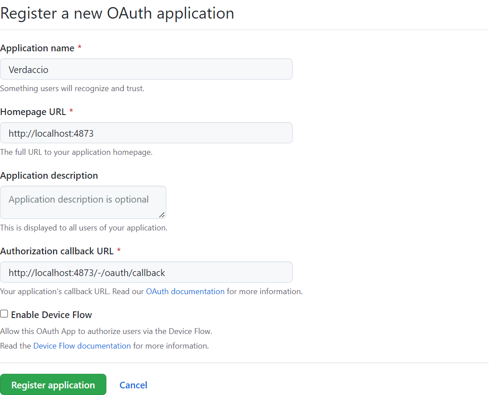
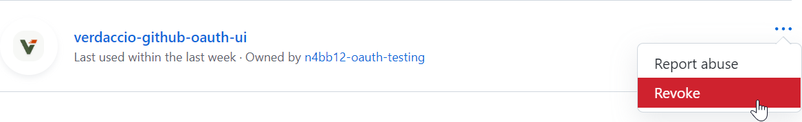

# Configuration

1. [Installing the Plugin](#installing-the-plugin)
   1. [Installing It Locally](#installing-it-locally)
   2. [Extending the Verdaccio Docker Image](#extending-the-verdaccio-docker-image)
   3. [Global Installation](#global-installation)
2. [Registering a GitHub OAuth Application](#registering-a-github-oauth-application)
3. [Configuring Verdaccio](#configuring-verdaccio)
   1. [`client-id` and `client-secret` (required, string)](#client-id-and-client-secret-required-string)
   2. [`token` (required, string)](#token-required-string)
   3. [`enterprise-origin` (optional, string)](#enterprise-origin-optional-string)
   4. [API Security](#api-security)
   5. [Using Environment Variables](#using-environment-variables)
4. [Configuring Package Access](#configuring-package-access)
5. [Configuring a Proxy](#configuring-a-proxy)
6. [Revoking Tokens](#revoking-tokens)
   1. [As a Registry User](#as-a-registry-user)
   2. [As a Registry Owner](#as-a-registry-owner)

### Compatibility

- Verdaccio 5.0 - 5.19
- Node 16
- npm 7+
- Browsers: See [browserslist](../.browserslistrc)

## Installing the Plugin

Some recommended ways to install the plugin:

### Installing It Locally

```bash
npm install verdaccio-google-oauth-ui
```

### Extending the Verdaccio Docker Image

See the [Dockerfile](../Dockerfile) for a simple example.

Verdaccio also has various [Docker
examples](https://github.com/verdaccio/verdaccio/tree/master/docker-examples).

### Global Installation

Avoid installing plugins globally, it is likely to cause problems (in general,
not just this plugin). See the
[troubleshooting](./troubleshooting.md#error-verdaccio-github-oauth-ui-plugin-not-found)
guide for more information on alternatives.

## Registering a Google OAuth Application

- Register a new OAuth application at
  https://github.com/settings/applications/new, or, if it should be owned by an
  organization, https://github.com/organizations/ORG_NAME/settings/apps/new
- The callback URL should be `YOUR_REGISTRY_URL/-/oauth/callback`

Example:



## Configuring Verdaccio

Merge the below options with your existing Verdaccio config:

```yml
middlewares:
  google-oauth-ui:
    enabled: true

auth:
  google-oauth-ui:
    client-id: GOOGLE_CLIENT_ID
    client-secret: GOOGLE_CLIENT_SECRET
    domain: GOOGLE_DOMAIN
```

### `client-id` and `client-secret` (required, string)

These values are used to perform OAuth authorization code flows on behalf of
your Google OAuth app.

You can find these values on the settings page of the GitHub app you previously
created.

### `domain` (optional, string)

The domain that's allowed to login

### API Security

This plugin doesn't support Verdaccio's legacy token encryption. Please use
the newer JWT configuration. See the corresponding [Verdaccio
docs](https://verdaccio.org/docs/configuration/#security) for instructions on
how to configure it.

### Using Environment Variables

The plugin options can be actual values or the names of environment variables
containing the values.

For example, either of the below will work:

- `client-id: abc`
- `client-id: GOOGLE_CLIENT_ID` and set an environment variable
  `GOOGLE_CLIENT_ID=abc`.

The environment variable names can be chosen freely. These are just examples.

## Configuring Package Access

The following groups can be used to configure package permissions (access,
publish, unpublish) as shown below:

```yml
packages:
  package1:
    # Limit access to signed-in users.
    # This works in tandem with other plugins that also add the `$authenticated` group, such as `htpasswd`.
    # Note that every Google user can sign in, so this is not a restrictive group.
    # If you want to limit access, use one of the other
    access: $authenticated

  package2:
    # Limit access to users:
    access: github/user/GITHUB_USER

  package3:
    # Limit actions to user repository collaborators:
    access: github/user/GITHUB_USER/repo/GITHUB_REPO

  package4:
    # Limit access to organization members:
    access: github/org/GITHUB_ORG

  package5:
    # Limit actions to team members:
    access: github/org/GITHUB_ORG/team/GITHUB_TEAM

  package6:
    # Limit actions to organization repository collaborators:
    access: github/org/GITHUB_ORG/repo/GITHUB_REPO
```

See [Package Access](https://verdaccio.org/docs/en/packages) for more examples.

## Configuring a Proxy

If you are behind a proxy, the plugin needs to know the proxy server URL to make
requests to the GitHub API. You can do that by configuring
[global-agent](https://github.com/gajus/global-agent) environment variables:

```bash
export GLOBAL_AGENT_HTTP_PROXY=http://127.0.0.1:8080
```

See the
[global-agent](https://github.com/gajus/global-agent#environment-variables) docs
for detailed configuration instrcutions.

## Revoking Tokens

### As a Registry User

- Go to https://github.com/settings/applications
- Find the OAuth app for your registry
- Click the <kbd>Revoke</kbd> button from the <kbd>...</kbd> menu as shown below



### As a Registry Owner

- Go to https://github.com/settings/applications, or, if owned by an org,
  https://github.com/organizations/ORG_NAME/settings/applications
- Find the OAuth app for your registry
- Open the OAuth app settings
- On the settings page click the <kbd>Revoke all user tokens</kbd> button
