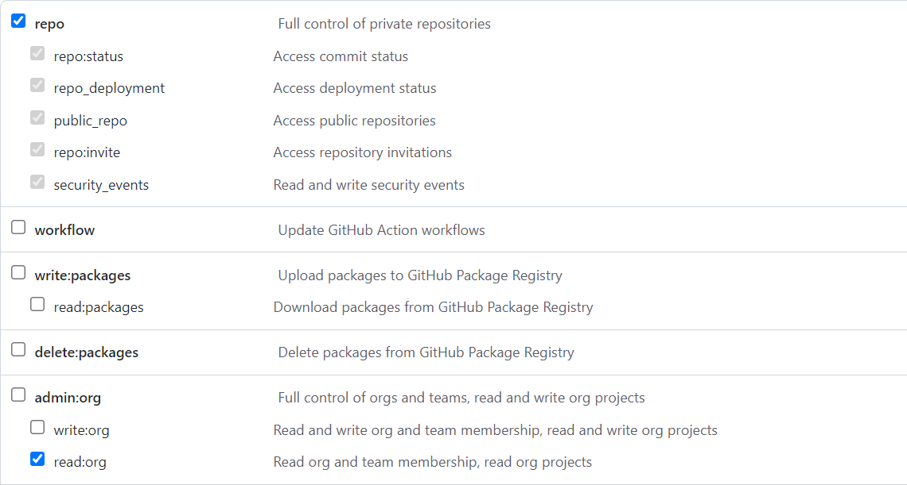

# ⚙️ Configuration

> 📥 To install the plugin, see [Installation](installation.md).

## 📝 Registering a GitHub OAuth Application

- Register a new OAuth application at
  https://github.com/settings/applications/new, or, if it should be owned by an
  organization, https://github.com/organizations/ORG_NAME/settings/apps/new
- The callback URL should be `YOUR_REGISTRY_URL/-/oauth/callback`

Example:


## 🛠️ Configuring Verdaccio

Merge the below options with your existing Verdaccio config:

```yml
middlewares:
  github-oauth-ui:
    enabled: true

auth:
  github-oauth-ui:
    client-id: GITHUB_CLIENT_ID
    client-secret: GITHUB_CLIENT_SECRET
    token: GITHUB_TOKEN
    enterprise-origin: GITHUB_ENTERPRISE_ORIGIN
```

### `client-id` and `client-secret` (required, string)

These values are used to perform OAuth authorization code flows on behalf of
your GitHub OAuth app.

You can find these values on the settings page of the GitHub app you previously
created.

### `token` (required, string)

This token needs to be created by a registry owner with access to all
organizations, teams, and repositories configured in your package access rules.

It is used to decide whether your users are able to access, publish, or
unpublish packages.

To create the token, go to https://github.com/settings/tokens/new and select
`repo` and `read:org`. The expiration time is up to you.



### `enterprise-origin` (optional, string)

If using a GitHub Enterprise instance, set this to the base URL of your
instance, for example: `https://github.example.com`.

If using the public GitHub instance, don't configure this option.

### `cache-ttl-ms` (optional, number)

By default, requests to get user's groups from Github API are cached for 10s.
You can change this value (in milliseconds) to adjust the cache duration.

### API Security

This plugin doesn't support Verdaccio's legacy token encryption. Please use
the newer JWT configuration. See the corresponding [Verdaccio
docs](https://verdaccio.org/docs/configuration/#security) for instructions on
how to configure it.

### Using Environment Variables

The plugin options can be actual values or the names of environment variables
containing the values.

For example, either of the below will work:

- `client-id: abc`
- `client-id: GITHUB_CLIENT_ID` and set an environment variable
  `GITHUB_CLIENT_ID=abc`.

The environment variable names can be chosen freely. These are just examples.

## 🔐 Configuring Package Access

The following groups can be used to configure package permissions (access,
publish, unpublish) as shown below:

```yml
packages:
  package1:
    # Limit access to signed-in users.
    # This works in tandem with other plugins that also add the `$authenticated` group, such as `htpasswd`.
    # Note that every GitHub user can sign in, so this is not a restrictive group.
    # If you want to limit access, use one of the other
    access: $authenticated

  package2:
    # Limit access to users:
    access: github/user/GITHUB_USER

  package3:
    # Limit actions to user repository collaborators:
    access: github/user/GITHUB_USER/repo/GITHUB_REPO

  package4:
    # Limit access to organization members:
    access: github/org/GITHUB_ORG

  package5:
    # Limit actions to team members:
    access: github/org/GITHUB_ORG/team/GITHUB_TEAM

  package6:
    # Limit actions to organization repository collaborators:
    access: github/org/GITHUB_ORG/repo/GITHUB_REPO
```

See [Package Access](https://verdaccio.org/docs/en/packages) for more examples.

## 🌐 Configuring a Proxy

If you are behind a proxy, the plugin needs to know the proxy server URL to make
requests to the GitHub API. You can do that by configuring standard proxy
environment variables:

```bash
export HTTP_PROXY=http://127.0.0.1:8080
```

Supported environment variables are `HTTPS_PROXY`, `https_proxy`, `HTTP_PROXY`, and `http_proxy`.
The plugin uses [undici ProxyAgent](https://github.com/nodejs/undici/blob/main/docs/docs/api/ProxyAgent.md) to handle proxy requests.
