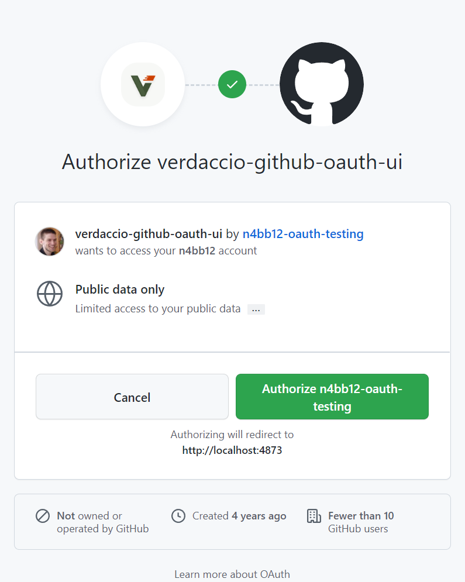
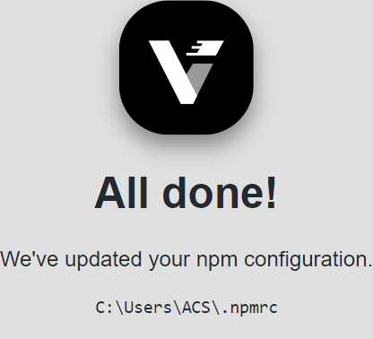
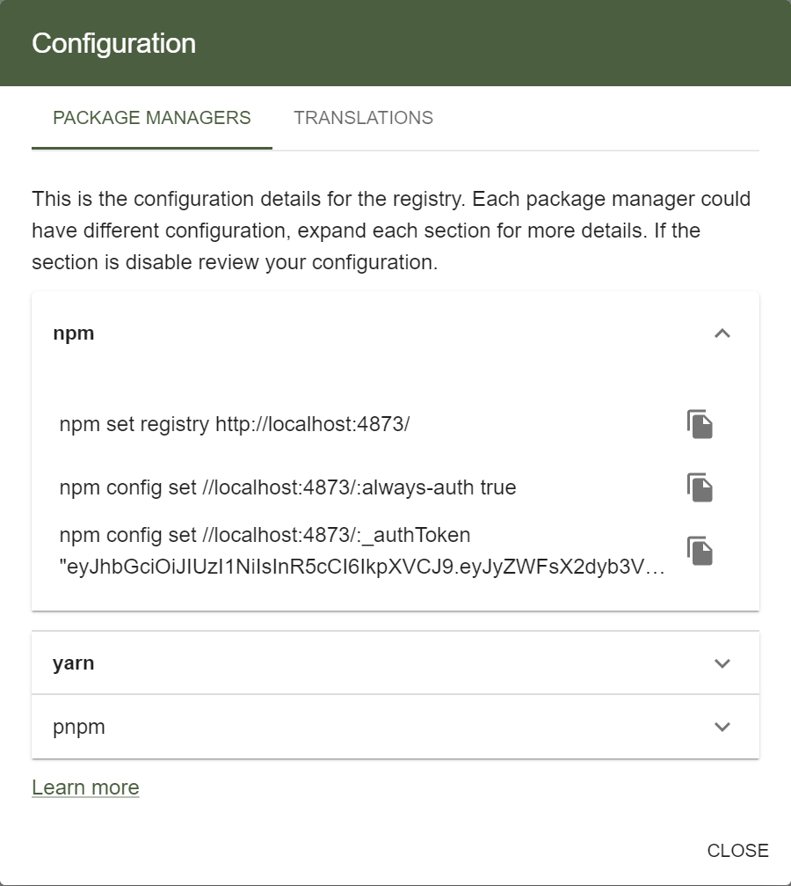

# 💻 Usage

## 🔑 Login

### On the Verdaccio UI



- Click the login button. You get redirected to GitHub and prompted to authorize
  the registry to access your public information.
- If the registry requires private org membership, click the <kbd>Request</kbd>
  or <kbd>Grant</kbd> button next to the org to get `read:org` access to the
  registry.
- Authorize the registry to access your GitHub user and org info. You only need
  to do this once.
- Once completed, you'll be redirected back to Verdaccio.
- You are now logged in 🎉.

### On the Command Line

#### Option A) Using the Built-In CLI

The easiest way to configure npm is to use this short command:

```bash
npx verdaccio-github-oauth-ui --registry http://localhost:4873
```

On success you should see this page in your browser:



#### Option B) Using the Commands from the UI

- Open the "Configuration" dialog and click "Copy to clipboard":



- Run the copied commands on your terminal:

```bash
npm config set //localhost:4873/:_authToken "SECRET_TOKEN"
```

- Verify npm is set up correctly by running the `whoami` command:

```bash
npm whoami --registry http://localhost:4873
```

If you see your GitHub username, you are ready to start installing and
publishing packages.

## 🚪 Signing Out

Click the <kbd>Logout</kbd> button as per usual.

## 🗑️ Revoking Tokens

Verdaccio has two authorization methods. Depending on your chosen method, you
will need to revoke the token in a different way.

You can read more about this in the Verdaccio docs:

- [Diving into JWT support for Verdaccio 4](https://verdaccio.org/blog/2019/04/19/diving-into-jwt-support-for-verdaccio-4)
- [Expiring Tokens](https://verdaccio.org/docs/best/#expiring-tokens)

You can find a more detailed breakdown of tokent types and token revocation in
[#176](https://github.com/n4bb12/verdaccio-github-oauth-ui/issues/176).

### With JWT Security

API/CLI tokens are valid for the duration you configured in the verdaccio config
at `security.api.jwt.sign.expiresIn`. UI tokens are valid for the duration you
configured in the verdaccio config at `security.web.sign.expiresIn`. After this
period, tokens are automatically invalid.

You can revoke **all** tokens for **all** users by changing the Verdaccio secret
in `storage/.verdaccio-db.json`.

### With AES Encryption (legacy)

You can revoke the token by revoking it in the GitHub settings.

#### As a Registry User

- Go to https://github.com/settings/applications
- Find the OAuth app for your registry
- Click the <kbd>Revoke</kbd> button from the <kbd>...</kbd> menu as shown below


#### As a Registry Owner

- Go to https://github.com/settings/applications, or, if owned by an org,
  https://github.com/organizations/ORG_NAME/settings/applications
- Find the OAuth app for your registry
- Open the OAuth app settings
- On the settings page click the <kbd>Revoke all user tokens</kbd> button

### Revoking the Registry Owner GitHub Token

GitHub memberships are determined using the `auth.github-oauth-ui.token` that
you configured in the verdaccio config.

This token can be revoked at https://github.com/settings/tokens where you
created it.
